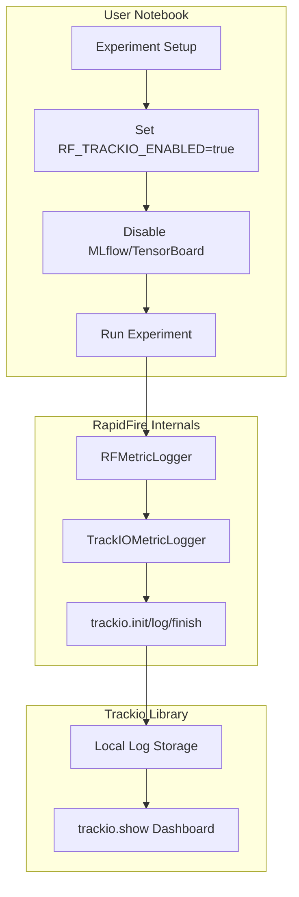

# Trackio Demo Notebook Plan

## Overview

Create a new notebook `rf-tutorial-sft-trackio.ipynb` in [`tutorial_notebooks/fine-tuning/`](tutorial_notebooks/fine-tuning/) that demonstrates Trackio integration with RapidFire AI. The notebook will be based on [`rf-tutorial-sft-chatqa-lite.ipynb`](tutorial_notebooks/rf-tutorial-sft-chatqa-lite.ipynb) and will run locally (not Colab), using Trackio as the standalone tracking backend.

## Branch Creation

Create a new branch `feat/trackio-demo-notebook` from the current branch.

## Architecture

## Key Implementation Details

The existing Trackio integration in the codebase ([`rapidfireai/utils/metric_trackio_manager.py`](rapidfireai/utils/metric_trackio_manager.py)) is already complete. The notebook will:

1. Enable Trackio via environment variable `RF_TRACKIO_ENABLED=true`
2. Disable other backends via `RF_MLFLOW_ENABLED=false` and `RF_TENSORBOARD_ENABLED=false`
3. Run the standard RapidFire experiment workflow
4. Demonstrate viewing metrics via `trackio show` command

## Notebook Structure

| Section | Description ||---------|-------------|| Header | RapidFire AI branding with links || Introduction | Explain Trackio as a local-first experiment tracking tool || Environment Setup | Configure tracking backend environment variables || Imports | Import RapidFire components || Dataset Loading | Load Bitext customer support dataset (same as source) || Data Processing | Define formatting function (same as source) || Experiment Init | Create Experiment with Trackio-enabled mode || Metrics Function | Define compute_metrics (same as source) || Model Configs | Define LoRA and SFT configs (same as source) || Create Model Function | Model factory (same as source) || Config Group | RFGridSearch setup (same as source) || Run Training | Execute `experiment.run_fit()` || View Dashboard | Instructions for `trackio show` command || End Experiment | Cleanup |

## Key Changes from Source Notebook

1. **New cells at start**: Configure environment variables to enable Trackio-only tracking
2. **New documentation cells**: Explain Trackio benefits (local-first, lightweight, no server needed)
3. **New cells at end**: Instructions for launching Trackio dashboard with `trackio show`
4. **Updated experiment name**: Use `exp1-sft-trackio-demo`

## Files to Create/Modify