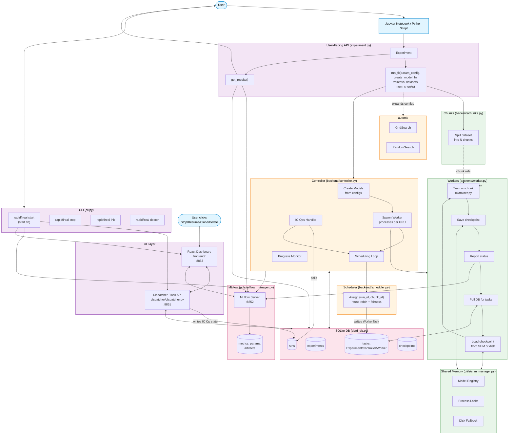

# RapidFire AI — Code Flow

## Flow Summary

1. **Entry** — User invokes `Experiment.run_fit()` from a notebook; AutoML expands param configs into multiple runs.
2. **Controller** spawns Worker processes (one per GPU) and runs the scheduling loop.
3. **Scheduler** assigns `(run_id, chunk_id)` pairs to workers via the `tasks` table using round-robin + fairness.
4. **Workers** poll the DB, load checkpoints from shared memory (disk fallback), train on the chunk, save the checkpoint back, and report metrics.
5. **Shared Memory** avoids disk I/O between chunks.
6. **MLflow** records metrics/params/artifacts; served on `:8852`.
7. **UI Layer** — Dispatcher (`:8851`) + React frontend (`:8853`) read from DB and MLflow; user IC Ops (Stop/Resume/Clone/Delete) write state changes back into the DB, which the Controller polls.
8. **CLI** (`rapidfireai start`) boots dispatcher, MLflow, and frontend.
